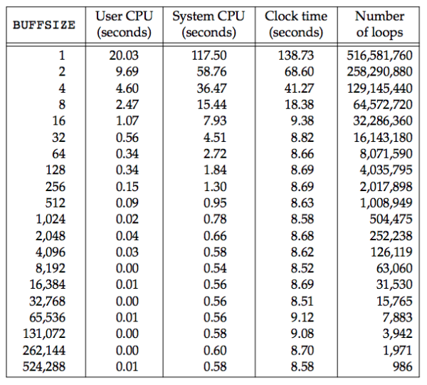

## 引言
本章介绍不带缓冲的I/O。不带缓冲I/O指的是每个`read`和`write`都调用内核中的一个系统调用。  
只要涉及在多个进程间共享资源，原子操作的概念就变得非常重要，本章会讨论多个进程如何共享文件。

## 文件描述符
- 打开的文件都是通过文件描述符
- 非负整数
- 打开/创建一个文件时，内核向进程返回一个文件描述符
- `shell`把文件描述符0与进程的标准输入关联，1与标准输出关联，2与标准错误关联

## `open` 和 `openat` 函数
```c
#include <fcntl.h>

int open(const char *path, int oflag, ... /* mode_t mode */ );
int openat(int fd, const char *path, int oflag, ... /* mode_t mode */ );

/* Both return: file descriptor if OK, −1 on error */
```
oflag参数可用来说明此函数的多个选项，一个或多个常量进行“或”运算构成oflag参数  
必须项：  
- `O_RDONLY`
- `O_WRONLY`
- `O_RDWR`
- `O_EXEC`
- `O_SEARCH`

## `create` 函数 
```c
#include <fcntl.h>

int creat(const char *path, mode_t mode);

/* Returns: file descriptor opened for write-only if OK, −1 on error */
```
等效于:
```c
open(path, O_WRONLY | O_CREAT | O_TRUNC, mode);
```
创建一个可读写的:
```c
open(path, O_RDWR | O_CREAT | O_TRUNC, mode);
```

## `close` 函数
```c
#include <unistd.h>

int close(int fd);

/* Returns: 0 if OK, −1 on error */
```
关闭一个文件时还会释放该进程加在该文件上的所有记录锁。  
当一个进程终止时，内核自动关闭它所有的打开文件。  

## `lseek` 函数
每个打开文件都有一个对应关联的"当前文件偏移量"，它通常是非负整数，通常读写操作都是从文件当前偏移量处开始，并使偏移量增加所读写的字节数，  
当打开一个文件时，除非指定append，否则偏移量是0
```c
#include <unistd.h>

off_t lseek(int fd, off_t offset, int whence);

/* Returns: new file offset if OK, −1 on error */
```
- SEEK_SET: 偏移量是距离文件开始offset个字节
- SEEK_CUR: 当前值加offset，offset可以为负
- SEEK_END: 文件长度加offset，offset可以为负

lseek仅将当前偏移量记录内核中，不会引起任何I/O操作。  
文件偏移量大于文件当前长度，对下一次写将加长该文件，并在文件中构成空洞，没有写过的字节被读为0。  
可以用`od -c`命令打印文件内容。  

## `read` 函数
```c
#include <unistd.h>

ssize_t read(int fd, void *buf, size_t nbytes);

/* Returns: number of bytes read, 0 if end of file, −1 on error */
```
read成功，返回读到字节数，如果达到文件尾端，返回0  
多数情况下，实际读到的字节数少于要求读的字节数:
- 普通文件: 在读到要求字节数之前已经达到了文件末端
- 终端设备: 通常一次最多读一行
- 网络: 网络中的缓存机制可能造成返回值小于所要求读的字节数
- 管道和FIFO: 若管道包含字节数少于所需数量，返回实际可用字节数
- 面向记录设备: 一次最多返回一个记录

## `write` 函数
```c
#include <unistd.h>

ssize_t write(int fd, const void *buf, size_t nbytes);

/* Returns: number of bytes written if OK, −1 on error */
```
返回值和参数nbytes相同，否则表示出错。write出错的常见原因是磁盘写满，或者超过了给定进程文件长度。

## I/O 效率
```c
#include "apue.h"

#define BUFFSIZE 4096

int
main(void)
{
    int n;
    char buf[BUFFSIZE];

    while ((n = read(STDIN_FILENO, buf, BUFFSIZE)) > 0)
    if (write(STDOUT_FILENO, buf, n) != n)
        err_sys("write error");

    if (n < 0)
        err_sys("read error");

    exit(0);
}
```
- 从标准输入读，写到标准输出。
- 考虑到进程终止，内核会关闭所有打开的文件描述符，所以此程序并不关闭输入输出文件
- 对于UNIX，文本和二进制文件并无区别

linux使用不同缓冲长度进行读操作的时间结果  
  

将标准的输出被重定向到`/dev/null`上，磁盘块长度4096字节，图中cpu时间几个最小值出现在buffersize为4096以及后的位置。  
大多数文件系统为了改善性能，都采用某种预读(read ahead)技术，当检测到正进行顺序读时，系统就试图读入比应用要求更多的数据。  

## 文件共享
打开文件的数据结构  
  
内核使用3中数据结构打开文件。  
- 每个进程在进程表中都有`记录项`，记录项中包含一张打开的文件描述符表，每个描述符相关联的是：
  - 文件描述符标志
  - 指向文件表项的指针
- 内核为所有打开文件维持一张`文件表`
  - 文件状态(读，写，添加，同步和非阻塞)
  - 当前文件偏移量
  - 指向该文件v节点表项的指针
- 每个打开的文件都有一个v节点  
  该节点包含了文件类型和对此文件进行各种操作函数的指针。对于大多数文件，v节点还包含了i节点，在文件打开时，从磁盘读入内存，文件信息可随时可用。  
  i节点包含了文件的所有者，文件长度，指向文件实际数据块在磁盘所在的位置的指针。  

2个进程打开同一个文件  
  
如图，打开该文件的每个进程都有自己的一个文件表项，但是一个给定的文件只有一个v节点表项，之所以每个进程都有自己的文件表项，是因为这可以使每个进程都有它自己的对该文件的当前偏移量。  
- 在完成write后，在文件表项中的当前文件偏移量增加所写入的字节数。
- 如果用APPEND标示打开一个文件，相应的标示会设置到文件表项中的文件状态中。每次执行写操作时，文件表项中的当前文件偏移量首先会被设置为i节点表项中的文件长度，使得每次写入数据都能追加到文件的当前尾端处
- 使用`lseek`定位到当前文件尾端，文件表项中的当前文件偏移量被设置为i节点表项中的当前文件长度
- `lseek`不会引起I/O操作
- `fork`和`dup` 父进程，子进程共享同一个文件表项

## 原子操作
### 追加到一个文件
早期的UNIX不支持open的APPEND，所以追加文件这样:
```c
if (lseek(fd, 0L, 2) < 0) /* position to EOF, 2 means SEEK_END */
    err_sys("lseek error");
if (write(fd, buf, 100) != 100) /* and write */
    err_sys("write error");
```
当多进程追加文件时，可能出现被覆盖问题。主要问题出现在 先定位，后追加。  
UNIX系统提供了一个原子的操作方法，打开文件时，设置APPEND标示。每次内核写操作之前，都将进程当前偏移量设置到文件的尾端处，不用每次写之前调用lseek。

### 函数pread 和 pwrite
```c
#include <unistd.h>

ssize_t pread(int fd, void *buf, size_t nbytes, off_t offset);
/* Returns: number of bytes read, 0 if end of file, −1 on error */

ssize_t pwrite(int fd, const void *buf, size_t nbytes, off_t offset);
/* Returns: number of bytes written if OK, −1 on error */
```
调用pread相当于调用lseek后调用read，但是pread与顺序调用有区别:
- 调用pread时，无法中断其定位和读操作
- 不更新当前文件的偏移量

## 函数dup 和 dup2
两个函数能复制一个现有的文件描述符:
```c
#include <unistd.h>

int dup(int fd);
int dup2(int fd, int fd2);

/* Both return: new file descriptor if OK, −1 on error */
```
`dup`  返回的新文件描述符一定是当前可用文件描述符中最小值。  
`dup2` 使用fd2，若fd2已经打开，则先关闭。若fd = fd2 ，返回fd2，而不关闭。否则，fd2的FD_CLOEXEC文件描述符标志就被清除。这样调用exec时是打开状态。  
  

假设我们执行了 `newfd = dup(1)`  
等效于调用 `fcntl(fd, F_DUPFD, 0);`
而调用 `dup2(fd, fd2);` 
等效于 `close(fd2); fcntl(fd, F_DUPFD, fd2);`  
dup2 不完全等效于 close + fcntl 主要:  
- dup2 是原子操作
- dup2 和 fcntl 的返回errno不同


