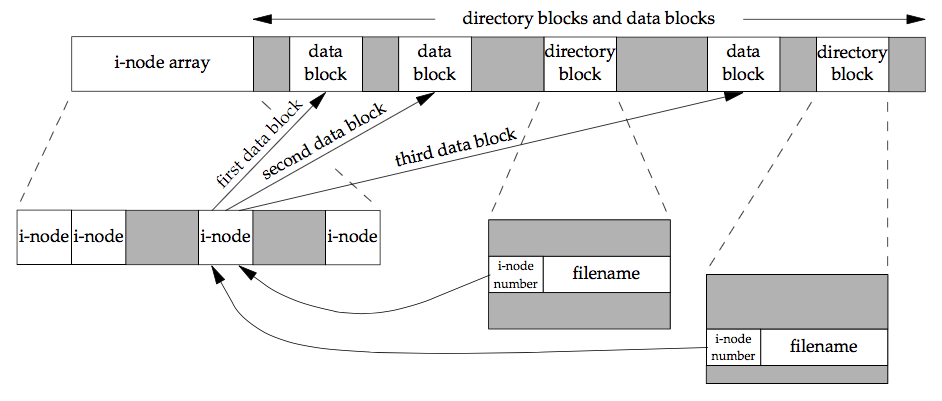

## 函数`stat` `fstat` `fstatat` `lstat`

```c
#include <sys/stat.h>

int stat(const char *restrict pathname, struct stat *restrict buf);
int fstat(int fd, struct stat *buf);
int lstat(const char *restrict pathname, struct stat *restrict buf);
int fstatat(int fd, const char *restrict pathname, struct stat *restrict buf, int flag);

/* All four return: 0 if OK, −1 on error */
```

- `stat` 返回此命名文件有关的信息结构
- `lstat` 返回符号链接的信息，而不是文件信息
- `fstat` 获取已在描述符fd上打开文件的信息
- `fstatat` 一个相对当前打开目录的路径名返回文件统计信息，flag参数控制是否跟随一个符号链接

## 文件类型
- 普通文件: 包含了某种形式的数据，至于这种数据是文本还是二进制，对unix内核无区别，对普通文件内容记的解释由处理该文件的应用程序进行。
- 目录文件: 包含了其他文件的名字以及指向与这些文件有关信息的指针，对一个目录文件具有读权限的任何一个进程都可以读该目录的内容，但只有内核可以直接写目录文件。
- 块特殊文件: 提供对设备(磁盘)带缓冲的访问，每次访问可以固定长度单位
- 字符特殊文件: 提供对设备不带缓冲访问，每次访问长度可变，系统中的设备，要么是字符特殊文件，要么是块特殊文件
- FIFO: 进程间通讯，也称为管道
- 套接字: 用于进程间的网络通信
- 符号链接: 指向另一个文件

## 文件长度
- 普通文件: 文件长度可以为0，在开始读这种文件时，将得到文件结束的标示
- 目录文件: 文件长度通常为一个数(16, 512)的倍数
- 符号链接: 文件长度是文件名的实际字节数( lib -> usr/lib 长度7)

## 文件空洞
```shell
$ ls -l core
-rw-r--r-- 1 sar 8483248 Nov 18 12:18 core
$ du -s core
272 core
```

## 文件系统
  
- 每个i-node节点都有一个链接计数，其值是指向该i-node节点的目录项数，只有当链接计数为0时，才可以删除文件(释放文件占用数据块)，这就是为什么"解出一个文件的链接"，并不意味着总是"释放该文件占用的磁盘块"
- i-node 节点包含了文件的所有信息: 文件类型，文件访问权限位，文件长度和指定文件数据块的指针等。`stat` 结构中的大多数信息都取自i-node节点。只有两项重要的数据存放在目录项中: 文件名，i-node编号
- 因为目录项中的i-node节点编号指向的是同一个系统中的相应i-node，同一个目录不能指向另一个文件系统的i-node，这就是为什么`ln`不能跨文件系统的原因
- 在不更换文件系统的情况下，为一个文件重命名，该文件的实际内容未移动，只需要构造一个指向现有i-node节点的新目录项，并删除老的目录项

## unlink
- 只有当链接计数达到0时，该文件的内容才会被删除，只要有进程打开了文件，其内容不能删除。关闭一个文件时，内核首先检查打开文件的进程个数，如果计数达到0，内核再去检查链接计数，如果计数为0，删除文件内容。  
- unlink这种特性，常用在 确保即使程序崩溃，它创建的额临时文件也不会遗留下来。
- unlink不会删除符号链接对应的文件
